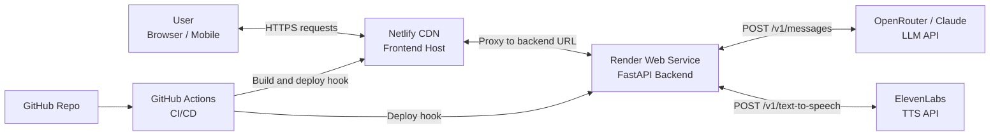
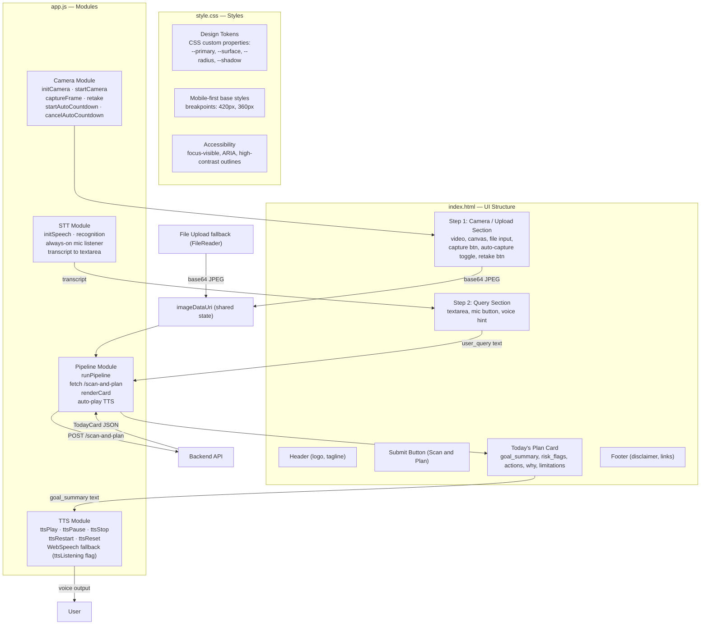
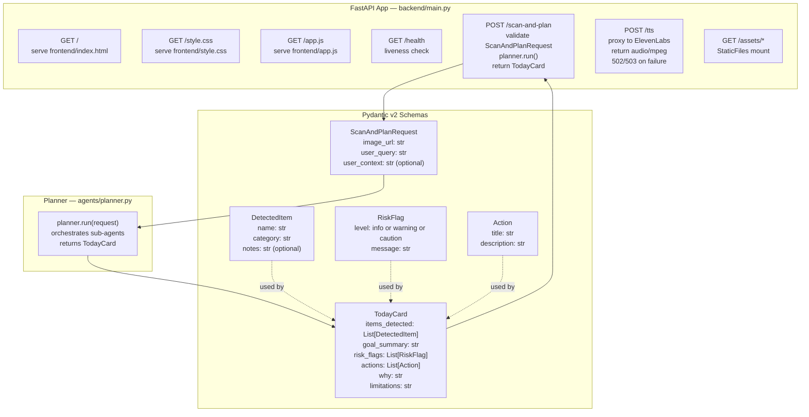
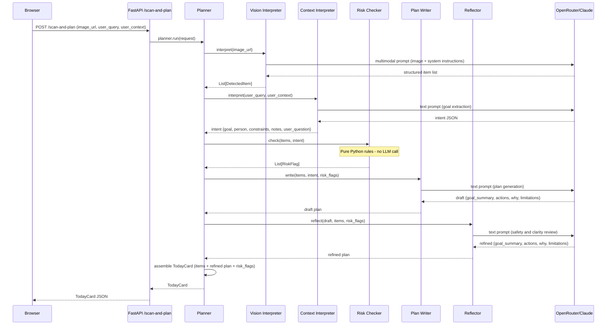
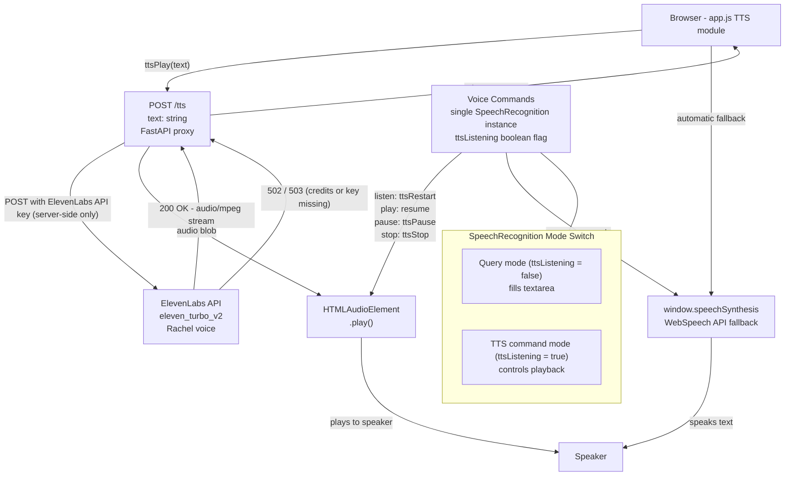
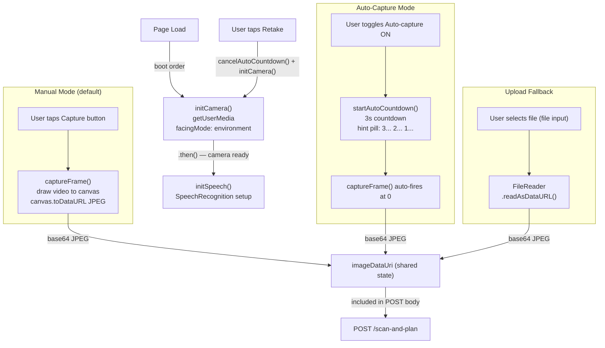
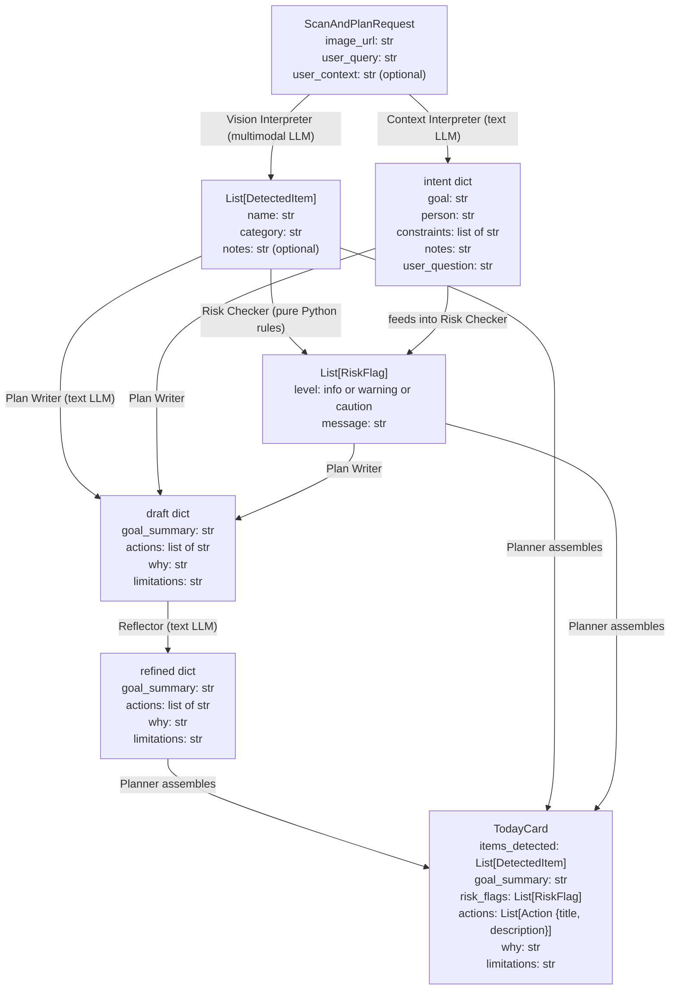
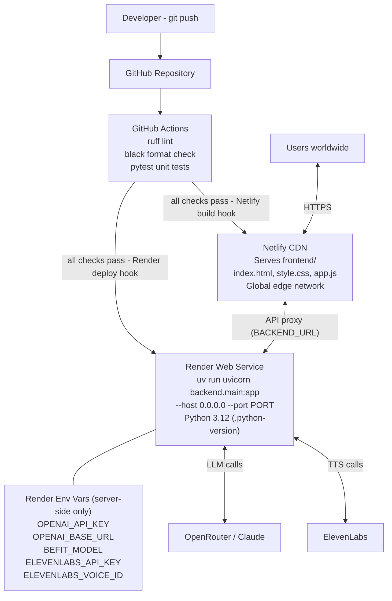

# Befit Architecture Diagram

**Date:** 2026-03-06
**Description:** Detailed architecture diagrams for the Befit multimodal wellness assistant — covering system overview, frontend, backend, agent pipeline, TTS, camera capture, data flow, and deployment.

---

## 1. System Overview

Befit is a cloud-deployed, multimodal wellness assistant. The browser/mobile client is served via Netlify's global CDN and communicates with a FastAPI backend hosted on Render. The backend orchestrates calls to external AI APIs (OpenRouter/Claude for LLM reasoning and ElevenLabs for text-to-speech). GitHub Actions provides CI/CD, triggering both Netlify and Render deployments on push.

---

## 2. Frontend Architecture

The frontend is intentionally minimal — three files served as static assets. `index.html` defines the UI structure, `style.css` provides mobile-first responsive styles and design tokens, and `app.js` contains all interactive logic split into four logical modules: Camera, STT, TTS, and Pipeline. Data flows from capture/upload through a single `imageDataUri` variable, then to the API, and finally to the rendered plan card (which triggers TTS auto-play).

---

## 3. Backend Architecture

The FastAPI backend (`backend/main.py`) serves both the frontend static files and the AI pipeline endpoints. The two core endpoints are `POST /scan-and-plan` (which drives the full agent pipeline) and `POST /tts` (which proxies ElevenLabs). All request/response bodies are validated via Pydantic v2 schemas, ensuring type safety throughout the pipeline.

---

## 4. Agent Pipeline (Core Flow)

The Befit agent pipeline follows a hierarchical planner-worker-reflector pattern. The Planner orchestrates five specialist sub-agents in sequence. The Vision Interpreter and Context Interpreter both call OpenRouter/Claude. The Risk Checker is a deterministic Python rules engine — no LLM call. Plan Writer and Reflector each make LLM calls. The Reflector is the final quality/safety gate before the assembled `TodayCard` is returned.

---

## 5. TTS Architecture

Audio output uses a dual-path architecture. The browser first calls the server-side `POST /tts` proxy, which forwards to ElevenLabs. If ElevenLabs is unavailable (credits exhausted, key missing, 502/503), the client automatically falls back to the browser's native `window.speechSynthesis` (WebSpeech API) — no server-side configuration required. A single `SpeechRecognition` instance handles both query input and TTS voice commands, mode-switched via a `ttsListening` boolean to prevent Chromium's silent mic-competition failure.

---

## 6. Camera & Capture Flow

The camera subsystem supports two capture modes sharing the same downstream path. Manual mode is the default; auto-capture is opt-in via toggle. Both modes produce an identical base-64 JPEG stored in `imageDataUri`, which is then sent to `/scan-and-plan`. A file upload fallback uses the same `FileReader → imageDataUri` path. On boot, `initCamera()` is called first and speech recognition is initialised only after the camera `getUserMedia` promise resolves — this prevents Chromium from silently invalidating the `SpeechRecognition` instance during permission grant.

---

## 7. Data Flow & Schemas

Every stage of the pipeline has a well-defined schema. Data enters as a `ScanAndPlanRequest`, is transformed by each agent into progressively richer structures, and exits as a fully assembled `TodayCard`. The Pydantic v2 schemas enforce type safety at the API boundary; agent-internal dicts (intent, draft) are validated via inline parsing before being passed to downstream agents.

---

## 8. Deployment Architecture

Befit uses a two-service cloud deployment: Netlify for the CDN-served frontend and Render for the Python backend. GitHub Actions enforces code quality (ruff, black, pytest) on every push and triggers both deployment hooks on success. All sensitive environment variables live exclusively on Render — the browser never sees any API keys. Python version is pinned via `.python-version` to ensure reproducible builds.

---

## Key Design Decisions

| Decision | Rationale |
|---|---|
| **Hierarchical Agent Pattern** | Planner orchestrates Vision Interpreter, Context Interpreter, Risk Checker, Plan Writer, then Reflector — mirroring Andrew Ng's plan-execute-reflect paradigm. Each agent has a single responsibility, making the pipeline debuggable and individually replaceable without rewiring the whole system. |
| **Single SpeechRecognition Instance (ttsListening flag)** | Chromium silently fails when two `SpeechRecognition` instances compete for the microphone simultaneously. A single instance mode-switched by a `ttsListening` boolean avoids this race condition — query capture and TTS voice commands never overlap. |
| **No-Diagnosis Safety Constraints** | Befit explicitly prohibits generating medical diagnoses, dosing instructions, or emergency guidance. These constraints are enforced in system prompts for every LLM-calling agent and reviewed by the Reflector. When uncertain, outputs are softened and clinician referral is recommended. |
| **WebSpeech Fallback Contract (502/503)** | ElevenLabs credits exhaust without warning. The contract is: server returns 502/503 on ElevenLabs failure; client detects this and silently falls back to `window.speechSynthesis`. Zero server-side configuration needed; the fallback is purely client-side and invisible to the user. |
| **Pre-unlock Pattern for Android 12+** | Android 12 requires a user gesture before `AudioContext` or `HTMLAudioElement.play()` is permitted. The TTS module gates audio playback on a prior user interaction (the submit tap) to satisfy this requirement, preventing silent audio failures on mobile. |
| **Rule-Based Risk Checker (No LLM)** | The Risk Checker uses deterministic Python rules rather than an LLM call. This makes risk flagging fast, transparent, auditable, and free from hallucination. Rules are documented in a simple table and can be extended without prompt engineering. |
| **Pydantic v2 Schemas** | All API request/response bodies are validated by Pydantic v2 models. This enforces type safety at the FastAPI boundary, provides automatic OpenAPI documentation, and ensures downstream agents always receive well-formed data — reducing runtime errors from malformed LLM outputs. |
